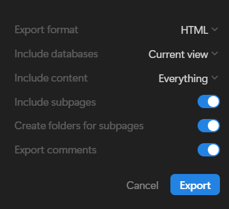
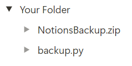
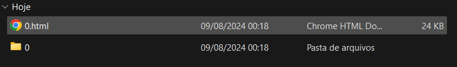

# Motivation
I recently discovered Notion's native backup system is not quite good. You can export all of your workspace, but you can't upload it back to Notion or use it locally whatsoever.

With that in mind, I tried to understand why I couldn't open the html file from the backup and access all of my pages. And what I found out is that the names of the html files are way too big (its the original name plus a 32 long unique id). So if you have, let's say, three nested pages you can't open the third one because of this.

So i wrote this simple python script that changes all the names of the files and folders and its references in other files. It may not be a very beautiful well coded script but it kinda works - for me at least :). So if you find any problems or suggestions I would gladly hear them.

That's it, hope it's useful!

# How to use
On Notion, click on the '...' icon at the top right corner of the page you want to backup and click on 'export'.

Make sure to export it as HTML and to mark every option:

Now, you have to download the python script (backup.py) and run it locally.

Make sure you have your zipped file from Notion and the python script in the same directory, just like this:

Then, just run the backup.py script and follow the instructions in the terminal.

To open your page locally, just click on '0.html':

# Streamlit App
I also made a streamlit app with this exactly tutorial because why not (you can donwload the script directly from there so maybe it could be easier for someone not familiar with GitHub idk)

Check it out: [View the app](https://notion-backup.streamlit.app/)